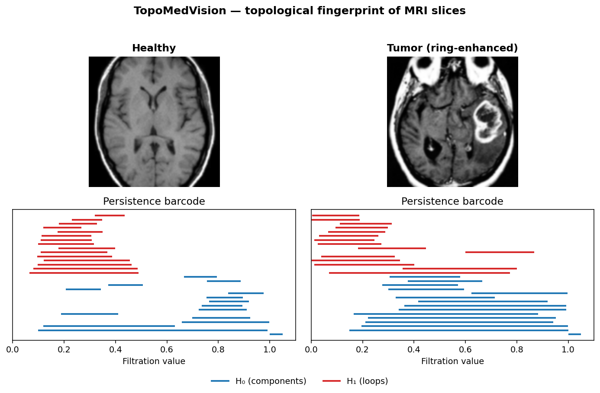
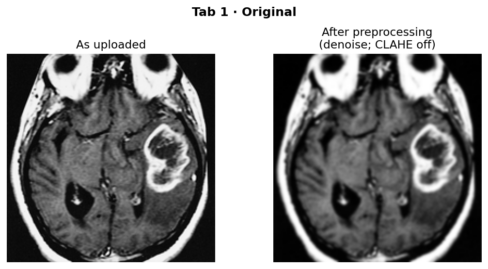
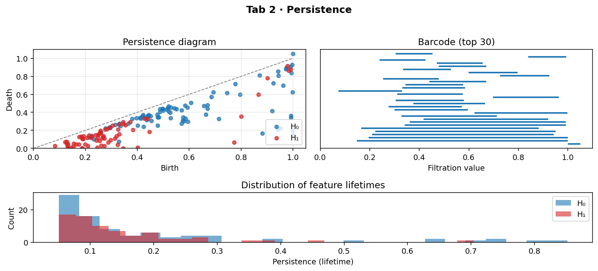
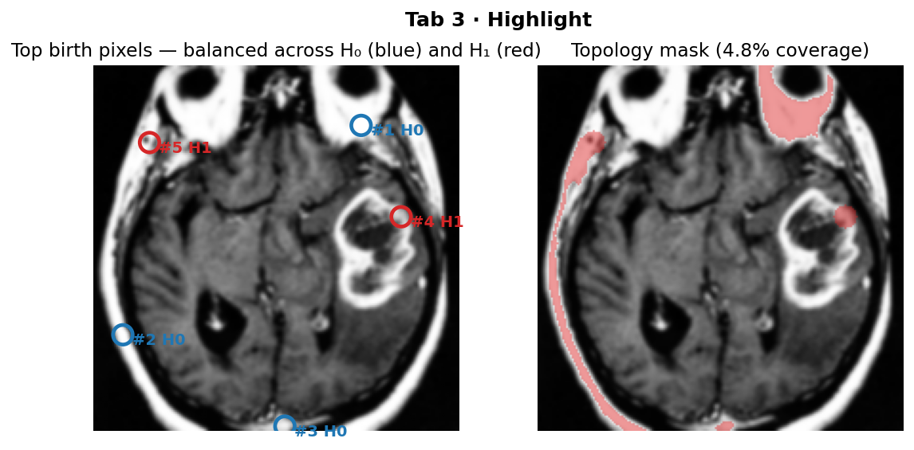
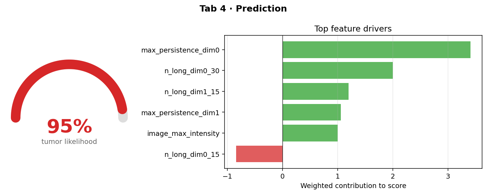
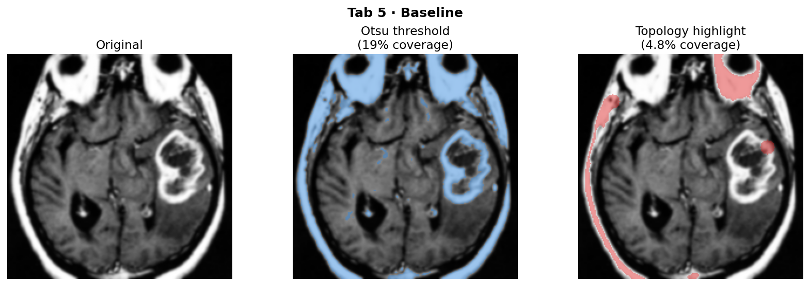

# TopoMedVision 🧠

> **Topological deep learning for brain tumor highlighting in MRI.**
> A research prototype that pairs *cubical persistent homology* with a
> lightweight classifier to surface candidate tumor regions in 2D MRI
> slices — and explains *why* it flagged them.

> ⚠️ **Educational prototype only.** Not FDA-approved. Not for clinical use.
> Sample images shipped with the repo are real public-domain MRI slices
> (AFIP teaching cases via Wikimedia Commons) used for demonstration only —
> see [Image attribution](#image-attribution) below.



---

## Why topological deep learning?

A standard neural unit is a weighted sum followed by a nonlinearity —
[Karpathy's neuron](https://cs231n.github.io/neural-networks-1/). It learns
features from raw pixel intensities. **Topological deep learning (TDL)**
augments that picture with features derived from the *shape* of the data —
invariants that survive small deformations, noise, and acquisition
differences. That property is attractive for medical imaging, where
scanner-to-scanner variation can derail a model trained on clean data.

This project demonstrates the bridge:

1. Treat each MRI slice's pixel intensity as a height function.
2. Compute its **cubical persistent homology** — a multiscale fingerprint of
   connected components and loops.
3. Feed that fingerprint into a small classifier *and* use it directly to
   build a spatial highlight mask.
4. Show side-by-side how this differs from a classical Otsu intensity
   threshold.

## What the demo shows

The Streamlit app loads a 2D MRI slice and walks through the topology
pipeline across five tabs. The figures below are produced by
`scripts/generate_screenshots.py` from the same code paths the app runs,
using the ring-enhanced glioblastoma sample (`05_tumor_ring_axial.png`) as
the running example.

### 1 · Original — what the topology layer actually sees



The raw upload on the left, the preprocessed slice on the right. Light
Gaussian denoising suppresses single-pixel speckle that would otherwise
inflate the diagram with hundreds of short-lived bars. CLAHE is off by
default — it can wash out the global "tumor is brighter" signal that
makes the persistence story work.

### 2 · Persistence — the topological fingerprint



The **diagram** plots every (birth, death) pair; points far from the
diagonal are robust features. The **barcode** ranks them by lifetime —
each long bar is a real shape feature, each short one is noise. The
**histogram** at the bottom shows the lifetime distribution: healthy
slices concentrate near zero, tumor slices grow a heavy tail. H₀ (blue)
tracks connected components (bright blobs); H₁ (red) tracks loops
(bright rings around dark cores).

### 3 · Highlight — turning persistence into a spatial mask



The top-`k` budget is split across H₀ (blue circles, bright connected
components) and H₁ (red circles, loops). Each marker is the birth
pixel of a specific persistence bar, then flood-filled into an
**overlay mask** (right) with tolerance proportional to that bar's
persistence. The split matters: on non-skull-stripped MRI like the
shipped samples, the *unbalanced* top-5 is dominated by skull/scalp
H₀ features (saturated bright pixels at the perimeter) and the lesion
loop never makes the cut. With the balanced split, the H₁ loop on the
ring-enhanced lesion (right side of the image, mid-height) gets
selected and its flood-fill region is what overlays the tumor in the
mask. See `select_top_features` in
[`backend/persistence.py`](backend/persistence.py).

### 4 · Prediction — the score and the reason for it



The score on the gauge (95 % on this slice) is the **average of two
scorers**: a hand-coded rule-based weighted sum over the 14-D
persistence feature vector, plus, if a trained classifier is on disk,
the Random Forest's `predict_proba`. With the shipped joblib loaded,
score = ½ × rule + ½ × RF. It is *not* a calibrated probability — it's
just the blended raw score.

**The shipped Random Forest is a stub.** It was trained on the six
sample images and does not generalize — with that little data, the
forest just memorizes the training set, which means it sharpens the
score on the six samples it has seen and contributes essentially noise
on anything else. It is in the repo to exercise the train → save →
load → blend code path end-to-end, so a real BraTS-trained classifier
can drop in later without changing anything in
[`backend/hybrid_model.py`](backend/hybrid_model.py) or
[`app.py`](app.py). The actual diagnostic logic lives in
[`_RULE_WEIGHTS`](backend/hybrid_model.py) as hand-coded constants.

The **bar chart shows the per-feature contributions of the rule
scorer** only — `weight × feature_value` for each entry in
`_RULE_WEIGHTS`. The RF half of the gauge is *not* decomposed in the
chart; rule weights are interpretable in a way RF importances aren't,
so the explanation panel is rule-only by design. (Adding an honest RF
explanation via SHAP is on the future-work list, and would only matter
once a real BraTS-trained model is in place.)

For the ring-enhanced glioblastoma above, the top contributions read as:

- **`max_persistence_dim0` (+3.4)** — the longest H₀ bar (longest-lived
  bright connected component). Large here because the lesion stays
  connected across a wide range of thresholds.
- **`n_long_dim0_30` (+2.0)** — count of H₀ bars with lifetime ≥ 0.30:
  more than one bright component survives aggressive threshold filtering.
- **`n_long_dim1_15` (+1.2)** and **`max_persistence_dim1` (+1.0)** —
  H₁ (loop) features. The bright rim around the dark necrotic core is
  a topological loop; in healthy parenchyma there's nothing comparable.
- **`image_max_intensity` (+1.0)** — brightest pixel after
  preprocessing. The one non-topological hint in the rule.
- **`n_long_dim0_15` (–0.85)** — *negative* hand-coded weight. At the
  looser 0.15 threshold, gyri / sulci / ventricle edges already produce
  many medium-lived H₀ bars, so the rule penalizes that count to
  prevent it from dominating the high-threshold signals above.

The point of this section isn't "the model figured out that long bars
mean tumor" — a human wrote that in. The point is that *the explanation
and the score share a representation*: every bar in the chart is a
scalar you could read off the persistence diagram in tab 2 by hand.
That's what makes the highlight, the score, and the diagram tell one
consistent story instead of three.

### 5 · Baseline — vs. classical intensity thresholding



Side-by-side comparison with **Otsu thresholding**, the classical
intensity-only baseline. The two methods are answering different
questions:

- **Otsu (~19 % coverage on this slice)** asks *"which pixels are
  bright?"* and lights up everything above its automatically-chosen
  intensity threshold. On a non-skull-stripped MRI that means the
  skull, the scalp, *and* the contrast-enhancing lesion all come back
  in one undifferentiated mask. It picks up the tumor — but you can't
  tell from the output that it did, because the lesion is visually
  indistinguishable from the rim of the skull.
- **Topology (~4 % coverage on this slice)** asks *"which features
  survive across many thresholds?"* and flood-fills only around the
  birth pixels of high-persistence bars. On this slice that lands on
  the ring-enhanced lesion plus a couple of equally persistent skull
  landmarks. It still includes some non-lesion structure, but the
  selection is *attributable*: each highlighted region traces back to
  a specific bar in the persistence diagram, so you can ask "why this
  pixel?" and get a number, not a vibe.

Lower coverage isn't intrinsically better — a 0 % mask would highlight
nothing. The point of the comparison is that the two methods *fail
differently*: Otsu's failure mode is "everything bright looks alike,"
which a clinician can't act on; topology's failure mode is "a few
non-lesion features have the same persistence as the lesion," which is
at least a tractable problem (skull-strip first, raise the persistence
threshold, or weight birth pixels by prior on lesion location). The
"Skull and scalp signal" item under Limitations is the same observation
from the other direction.

## Run it locally

```bash
git clone <your-fork>
cd topomedvision
python -m venv .venv && source .venv/bin/activate
pip install -r requirements.txt

python scripts/train_classifier.py         # trains the demo Random Forest
python scripts/generate_screenshots.py     # optional: refreshes assets/

streamlit run app.py                       # then open http://localhost:8501
```

Pick a sample from the sidebar (e.g. `05_tumor_ring_axial.png`) and
click through the five tabs above.

> The six sample MRIs in `data/samples/` are real public-domain images
> shipped with the repo — no generation step is needed. The setup scripts
> are one-shot: rerun them only when you want to retrain the classifier or
> regenerate the README screenshots. The Streamlit app picks up
> `models/topo_classifier.joblib` automatically when present, and falls
> back to the rule-based scorer if it's missing.

## Tests

```bash
pip install pytest
pytest tests/                              # 23 tests across both backends
```

The suite verifies the persistence math (single-peak, two-peak, four-peak,
threshold filtering, sort order, mask shape) on **both** the gudhi backend
and the pure-NumPy fallback, and includes a cross-backend agreement check
for clean inputs.

## Deploying to Hugging Face Spaces

The repo is HF-Spaces-ready: the YAML frontmatter at the top of this
README declares it as a Streamlit Space, and `models/topo_classifier.joblib`
+ `data/samples/*.png` are tracked so the app starts immediately on first
load — no build step.

```bash
# One-time: create a new Space at https://huggingface.co/new-space
# Choose SDK = "Streamlit", note its git URL, then:

git remote add space https://huggingface.co/spaces/<user>/<space-name>
git push space main
```

After the push, HF Spaces installs `requirements.txt` and runs `app.py`
automatically. The first build can take a while because gudhi compiles
from source in the container. The Space's public URL is shareable as
your demo link.

## Architecture

```
                  ┌────────────────────┐
   image upload → │  utils.preprocess  │  → 192×192 float [0,1]
                  └─────────┬──────────┘
                            │
                  ┌─────────▼─────────────────────────┐
                  │  persistence.compute_cubical_…    │  gudhi ▸ numpy fallback
                  │  → dim0 / dim1 PersistencePairs   │
                  │     with spatial birth coords     │
                  └─────────┬─────────────────────────┘
                            │
              ┌─────────────┼─────────────────────────────┐
              │             │                             │
   ┌──────────▼─────┐ ┌─────▼─────────┐  ┌────────────────▼──────┐
   │ topology_mask  │ │ persistence_  │  │  hybrid_model.        │
   │ (flood-fill    │ │ features      │→ │  score_tumor_likelihood│
   │  overlay)      │ │ (14-D vector) │  │  (rule + optional RF) │
   └──────────┬─────┘ └───────────────┘  └────────────────┬──────┘
              │                                            │
              └─────────────  Streamlit UI  ───────────────┘
```

### Module layout

```
topomedvision/
├── app.py                   # Streamlit demo (5 tabs)
├── requirements.txt
├── backend/
│   ├── __init__.py
│   ├── utils.py             # image I/O, preprocessing, overlay helpers
│   ├── persistence.py       # cubical PH (gudhi + union-find fallback)
│   ├── hybrid_model.py      # 14-D feature vector + rule/learned scorer
│   └── visualization.py     # matplotlib + plotly views
├── data/
│   ├── samples/             # six real public-domain MRI PNGs + labels.json
│   ├── generate_samples.py  # legacy synthetic-cartoon generator (not used)
│   └── README_data.md       # sample sources, attribution, BraTS hookup
├── scripts/
│   ├── train_classifier.py  # trains the demo Random Forest on samples
│   └── generate_screenshots.py  # regenerates assets/ for the README
├── notebooks/
│   └── exploration.ipynb    # end-to-end walk-through
├── cpp_wrapper/
│   └── README.md            # CubicalRipser interop (stretch)
├── models/                  # pickled scikit-learn classifier (tracked)
└── assets/                  # screenshots used by the README
```

## Math background

Treat a grayscale image $f \colon \Omega \to \mathbb{R}$ as a height function.
The **sublevel-set filtration** is the family of binarizations
$X_t = \{p \in \Omega : f(p) \le t\}$, indexed by $t \in \mathbb{R}$.
As $t$ grows from $-\infty$ to $+\infty$:

- **0-dimensional homology** ($H_0$) tracks connected components of $X_t$.
- **1-dimensional homology** ($H_1$) tracks loops (1-cycles that aren't
  boundaries of 2-cells in $X_t$).

Each topological feature has a *birth* value $b$ (the $t$ at which it
appears) and a *death* value $d$ (the $t$ at which it merges with an older
feature, or vanishes). The **persistence** of a feature is $|d - b|$ — its
robustness to threshold perturbations.

For 2D images we work on a **cubical complex** (each pixel is a 2-cell). The
algorithms in [CubicalRipser](https://github.com/shizuo-kaji/CubicalRipser_3dim)
and [GUDHI](https://gudhi.inria.fr/) compute the persistence diagram in
near-linear time on the number of pixels.

In a tumor-vs-healthy MRI slice you typically see:

- **Tumor masses** → a few **long $H_0$ bars** (compact bright blobs that
  stay connected over a wide threshold range).
- **Ring-enhanced lesions** (bright rim, dark necrotic core) → at least
  one **persistent $H_1$ bar**, because a dark interior surrounded by
  bright pixels is geometrically a loop.
- **Healthy parenchyma** → many short bars (texture noise) and very few
  long ones.

`backend/hybrid_model.py` turns these intuitions into a 14-dimensional
feature vector (Betti curve summaries + lifetime statistics + intensity
stats) and feeds it to either a hand-tuned weighted sum or a scikit-learn
Random Forest.

## How robustness works in practice

Pixel-level CNNs can get derailed by intensity scaling, scanner gain
differences, or small geometric warps. Persistence is **stable** in a strong
mathematical sense: if you perturb $f$ by at most $\varepsilon$ in the
sup-norm, the bottleneck distance between persistence diagrams is at most
$\varepsilon$ (Cohen-Steiner–Edelsbrunner–Harer 2007). The Original tab
exposes the denoise and CLAHE toggles so you can perturb the input and
compare diagrams; the stability theorem predicts that long bars should
move only a little while short, noisy bars shuffle freely.

## Backends

| Backend | Status | Notes |
|---|---|---|
| `gudhi` | ✅ default if installed | Used for both 0D and 1D persistence; recovers spatial coordinates via `cofaces_of_persistence_pairs`. |
| Pure NumPy union-find | ✅ always available | Implements 0D persistence via the elder rule on a 4-connected pixel filtration. Approximates 1D via the dual filtration. |
| `cripser` (CubicalRipser binding) | 🟡 stretch goal | See [`cpp_wrapper/README.md`](./cpp_wrapper/README.md) for the drop-in path. |
| `topomodelx` simplicial NN | 🟡 stretch goal | Add to `requirements.txt` and replace the Random Forest in `hybrid_model.py`. |

The active backend is reported under the **Persistence** tab so you always
know which code path produced the diagram.

## Limitations

- **2D only.** Real diagnostic radiology reads volumes; this is a single
  2D slice. The persistence layer itself would generalize — gudhi's
  `CubicalComplex` accepts arbitrary-dimensional cubical input — but the
  preprocessing, mask flood-fill, feature vector, scorer, and Streamlit
  UI would all need work; "swap an argument" undersells it.
- **The shipped classifier is a stub.** `scripts/train_classifier.py`
  trains a Random Forest on the six bundled MRI slices, which memorizes
  them; on unseen images its contribution is noise. The joblib exists
  so the train → save → load → blend code path is wired up — a real
  BraTS-trained classifier can be dropped in (after enlarging
  `data/samples/` and updating `labels.json`) without touching any call
  sites. Until then, the rule scorer in `backend/hybrid_model.py` is
  what actually carries the prediction.
- **Tiny sample set.** Six images is enough to demonstrate the topology
  fingerprint qualitatively but nowhere near enough to make accuracy
  claims. Real BraTS-scale evaluation needs hundreds-to-thousands of
  slices and proper train / val / test splits.
- **Skull and scalp signal.** The bundled samples are *not*
  skull-stripped, so persistent H₀ components from bright skull/scalp
  pixels contribute to the topology mask. A real pipeline would prepend
  a skull-stripping step (e.g. HD-BET) before the persistence layer.
- **Compute.** Measured on this laptop, a 192×192 slice takes ~70 ms
  with `gudhi` and ~270 ms with the pure-NumPy fallback (median of
  several runs after warm-up). Larger slices grow super-linearly with
  pixel count.
- **No segmentation guarantee.** The flood-fill mask is a *highlight*, not
  a segmentation. It will under-cover diffuse lesions and miss any
  feature whose birth pixel sits outside the visible mass.

## Image attribution

All six bundled MRI slices in `data/samples/` are real, public-domain
images. Per-image source URLs and licenses live in
[`data/samples/labels.json`](./data/samples/labels.json); the summary:

| File | Subject | Source | License |
|---|---|---|---|
| `01_healthy_axial_t1.png` | Healthy brain, axial T1 | Wikimedia Commons — [`File:T1t2PD.jpg`](https://commons.wikimedia.org/wiki/File:T1t2PD.jpg) (left panel cropped), KieranMaher | Public domain |
| `02_healthy_sagittal_t1.png` | Healthy brain, sagittal T1 | Wikimedia Commons — [`File:MRI_brain.jpg`](https://commons.wikimedia.org/wiki/File:MRI_brain.jpg) | Public domain |
| `03_tumor_solid_axial.png` | Sub-ependymal giant cell astrocytoma, axial T1+C | Wikimedia Commons — [`File:MRI_of_brain_with_sub-ependymal_giant_cell_astrocytoma.jpg`](https://commons.wikimedia.org/wiki/File:MRI_of_brain_with_sub-ependymal_giant_cell_astrocytoma.jpg) (AFIP) | Public domain (17 U.S.C. § 105) |
| `04_tumor_solid_sagittal.png` | Pilocytic astrocytoma, hypothalamic, sagittal T1+C | Wikimedia Commons — [`File:405615R-PA-HYPOTHALAMIC.jpg`](https://commons.wikimedia.org/wiki/File:405615R-PA-HYPOTHALAMIC.jpg) (AFIP) | Public domain (17 U.S.C. § 105) |
| `05_tumor_ring_axial.png` | Glioblastoma multiforme (textbook ring enhancement), axial T1+C | Wikimedia Commons — [`File:AFIP-00405558-Glioblastoma-Radiology.jpg`](https://commons.wikimedia.org/wiki/File:AFIP-00405558-Glioblastoma-Radiology.jpg) | Public domain (17 U.S.C. § 105) |
| `06_tumor_ring_recurrent.png` | Recurrent multifocal glioblastoma, axial T1+C | Wikimedia Commons — [`File:AFIP-00405589-Glioblastoma-Radiology.jpg`](https://commons.wikimedia.org/wiki/File:AFIP-00405589-Glioblastoma-Radiology.jpg) | Public domain (17 U.S.C. § 105) |

All images were center-cropped to square and resampled to 192 × 192
grayscale. The originals (variable resolution and aspect ratio) are
linked above. The four AFIP images are works of the U.S. federal
government and are therefore in the public domain in the United States.

## Future work

- **Full 3D volumes** with proper sub-volume cropping around the brain.
- **TopoModelX integration**: build a simplicial complex from the image
  superlevel-set graph and run a learned simplicial attention layer on top.
- **Persistence images** as input to a small CNN for an end-to-end learned
  variant; compare to the rule-based scorer on a held-out set.
- **Honest RF explanations.** Today the bar chart in the Prediction tab
  shows the rule scorer's hand-coded contributions only; the RF half of
  the score isn't decomposed. Plug in SHAP (or RF feature contributions
  via `treeinterpreter`) so the explanation reflects both halves of the
  blended score.
- **CubicalRipser C++ subprocess** for an order-of-magnitude speedup on
  larger slices; see [`cpp_wrapper/README.md`](./cpp_wrapper/README.md).
- **Regulatory note.** Any clinical adaptation would need IRB review,
  prospective validation on the target scanner population, and FDA SaMD
  classification.

## References

- Edelsbrunner, Letscher & Zomorodian, *Topological Persistence and
  Simplification*, 2002.
- Cohen-Steiner, Edelsbrunner & Harer, *Stability of Persistence
  Diagrams*, 2007. — the stability theorem cited above.
- Kaji, Sudo & Ahara, *CubicalRipser: software for computing persistent
  homology of image and volume data*, 2020.
  https://github.com/shizuo-kaji/CubicalRipser_3dim
- The GUDHI project. https://gudhi.inria.fr/
- Hajij et al., *Topological Deep Learning: Going Beyond Graph Data*,
  2023. (TopoModelX / TopoNetX).
- BraTS challenge. https://www.med.upenn.edu/cbica/brats2020/
- Karpathy, [CS231n notes on the neuron model](https://cs231n.github.io/neural-networks-1/).
